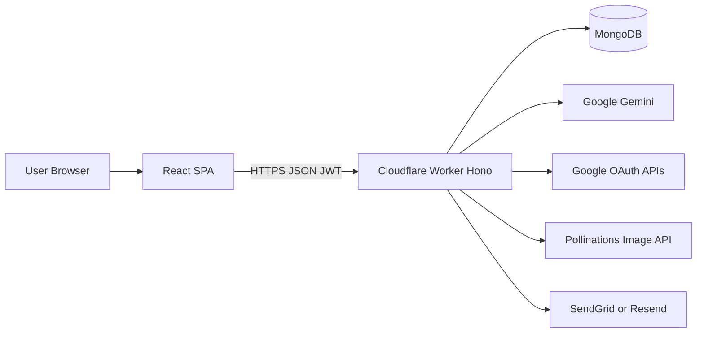

# Architecture — How TOM.ai works

TOM.ai is a **React SPA** talking to a **Cloudflare Workers** API, with **MongoDB** for persistence and **Gemini** (plus optional providers) for AI.

## Layers

| Layer | Location | Role |
|-------|----------|------|
| Frontend | `frontend/` | UI, routing, guest chat, OAuth redirect handling |
| Backend | `backend/` | Auth, chat, RAG, tasks, admin, cron |
| Database | MongoDB | Users, chat, tasks, documents, vectors, config |
| AI providers | Gemini / OpenAI / Anthropic | Chat, embeddings, optional routing |
| Integrations | Google APIs | Sign-in + Gmail / Calendar / Tasks |

## Request flow (authenticated chat)

1. User signs in (email+OTP or Google) → backend issues a **JWT** (7 days).
2. Frontend stores the token and sends `Authorization: Bearer <token>` on API calls.
3. `POST /api/chat/message` loads history, optional RAG context, and Google tool tokens.
4. `geminiService` calls the selected model (default Gemini Flash), may invoke tools, and stores the reply.
5. Messages may be embedded into the vector store for later retrieval.

## Guest vs authenticated

| Mode | Behavior |
|------|----------|
| **Guest** | Chat answers come from client-side heuristics in `frontend/src/utils/guestAI.js` — no backend AI call |
| **Authenticated** | Full chat, tasks, RAG, Google connect, image gen via API |

## Compatibility shims

The Worker uses Express-style routers and a Mongoose-like API on top of Cloudflare-friendly packages:

- `backend/config/expressCompat.js` — Hono ↔ Express-style `req`/`res`
- `backend/config/dbCompat.js` — MongoDB driver ↔ Mongoose-like models

That keeps route/model code familiar while deploying as a Worker.

## Frontend routing (high level)

| Path | Page |
|------|------|
| `/` | Welcome / landing |
| `/chat` | Main chat (+ Personal RAG mode) |
| `/todos` | Tasks (auth required) |
| `/settings` | Account & connections |
| `/login`, `/signup`, `/forgot-password` | Auth |
| `/terms`, `/privacy` | Legal |
| `/image-gen` | Image generation |
| `/admin` | Admin panel |
| `/auth/google/callback` | OAuth callback |

## Backend mount points

All JSON APIs live under `/api/*`. See [API reference](./api.md).

## Data stored in MongoDB

| Kind | Examples |
|------|----------|
| Identity | Users, TempOTP |
| Product data | ChatHistory, Task, Reminder |
| RAG | PersonalDocument metadata, VectorDocument embeddings |
| Ops | `configs` collection for admin AI/MCP/RAG settings |

Default database name: `tom-ai-db`.

## Scheduled work

Worker cron triggers (see `backend/wrangler.toml`):

- **Every minute** — check task reminders (IST time match) and send email
- **Daily midnight** — clean up old completed/cancelled tasks (30+ days inactive)

## Security boundaries

- User JWT vs admin JWT (`JWT_SECRET` vs `JWT_SECRET + '-admin'`)
- Admin tokens cannot call normal user routes
- Google “sign-in” scopes are separate from “connect” scopes (Gmail/Calendar/Tasks)
- Personal documents are scoped by `userId`
