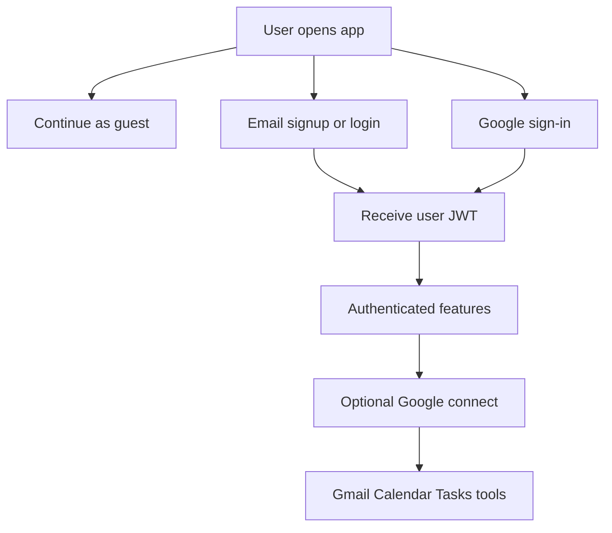

# Authentication

TOM.ai supports email/password (OTP), Google sign-in, and a separate Google **connect** flow for integrations.

## Email signup

1. `POST /api/auth/signup-send-otp` with email → OTP stored in `TempOTP`, emailed via SendGrid/Resend.
2. User enters OTP + password (+ name).
3. `POST /api/auth/signup-verify-otp` → user created, password hashed with **bcrypt**, **JWT** returned (7d).

OTP validity: see `backend/config/constants.js` (typically 10 minutes).

## Email login

`POST /api/auth/login` with email + password → bcrypt compare → JWT.

If email matches `ADMIN_USERNAME` and password matches `ADMIN_PASSWORD`, login may return an **admin** token for `/admin`.

## Forgot password

1. `forgot-password` — send OTP to email  
2. `verify-reset-otp`  
3. `reset-password` — set new password  

## Google sign-in

**Scopes:** `openid profile email` (identity only).

1. Frontend builds Google OAuth URL (`frontend/src/utils/googleAuth.js`) using `REACT_APP_GOOGLE_CLIENT_ID` and sign-in redirect URI.
2. User returns to `/auth/google/callback`.
3. Frontend posts `code` to `POST /api/auth/google/callback`.
4. Backend exchanges code, loads userinfo, creates or links `User` (`googleId`, Google tokens), returns JWT.

## Google connect (integrations)

**Requires** an existing user JWT. **Scopes:** Gmail readonly, Calendar, Tasks.

1. `GET /api/oauth/google/connect-url`
2. User consents at Google
3. `POST /api/oauth/google/connect-callback` stores tokens under `User.tokens` and permission flags
4. Chat tools can call Google APIs on the user’s behalf
5. Revoke via `/api/oauth/revoke/*` or Google account settings

Sign-in and connect may use **different redirect URI env vars**:

- `GOOGLE_SIGNIN_REDIRECT_URI` / `REACT_APP_GOOGLE_SIGNIN_REDIRECT_URI`
- `GOOGLE_CONNECT_REDIRECT_URI` / `REACT_APP_GOOGLE_CONNECT_REDIRECT_URI`

## JWT rules

| Token | Secret | Used for |
|-------|--------|----------|
| User | `JWT_SECRET` | Chat, tasks, RAG, oauth connect, settings |
| Admin | `JWT_SECRET + '-admin'` | Admin panel APIs only |

Middleware: `backend/middleware/auth.js`.

## Frontend storage

Tokens and user profile are stored in browser storage helpers under `frontend/src/utils/storage.js`. Axios attaches the Bearer token in `frontend/src/services/api.js`.
