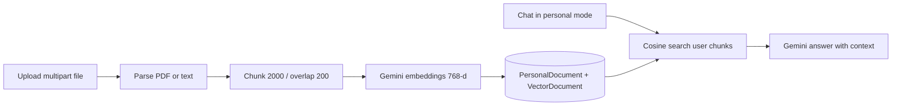

# Personal RAG

Personal RAG mode lets users upload documents and ask questions grounded in those files.

## User experience

1. Switch chat mode to **Personal**.
2. Open **Knowledge Base**.
3. Upload PDF, TXT, or Markdown (max **100 MB** per file).
4. Ask questions in the chat input — answers should be grounded in uploaded content.

UI: Knowledge Base panel inside `frontend/src/pages/Chat.jsx`.

## Pipeline

## API

| Step | Endpoint |
|------|----------|
| Upload | `POST /api/rag/upload` |
| List | `GET /api/rag/documents` |
| Delete | `DELETE /api/rag/documents/:id` |

## Size & format limits

| Rule | Value |
|------|-------|
| Max file size | **100 MB** (frontend + backend) |
| Formats | PDF, TXT, MD / Markdown (JSON extension allowed in backend check) |
| Batch upload UI | Up to 10 files at a time |

## Storage model

| Collection / model | Contents |
|--------------------|----------|
| `PersonalDocument` | Filename, size, chunk count, userId, timestamps |
| `VectorDocument` | Embedding vector, chunk text, metadata (`type: personal_doc`, doc id, chunk index) |

## Chat modes

| Mode | Retrieval behavior |
|------|--------------------|
| `personal` | Search only this user’s personal documents |
| `standard` | Broader RAG helpers over the user’s indexed content (see `geminiService`) |

## Implementation files

- Routes: `backend/routes/rag.js`
- Service: `backend/services/ragService.js`
- Models: `backend/models/PersonalDocument.js`, `VectorDocument.js`
- Frontend upload UI: `KnowledgeBasePanel` in `Chat.jsx`

## Operational notes

- Embedding loops include delays to respect Gemini free-tier RPM limits.
- Large PDFs mean more chunks → longer indexing time and more embedding calls.
- Deleting a document removes its vectors as well.
